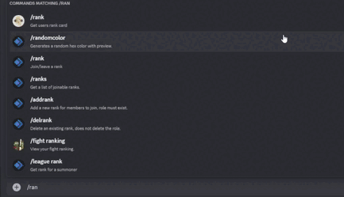
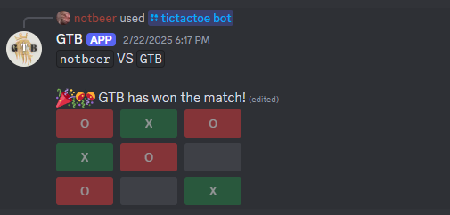
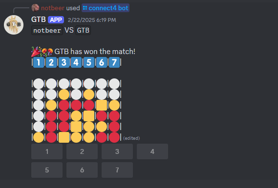
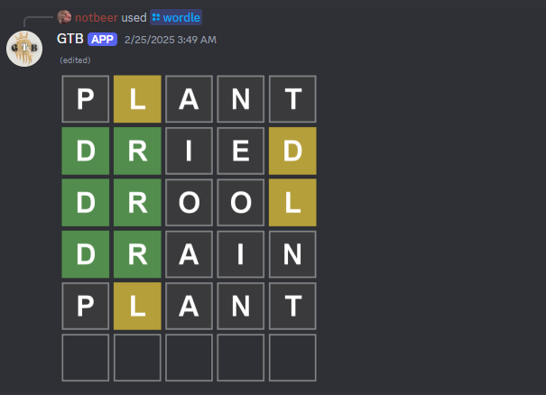
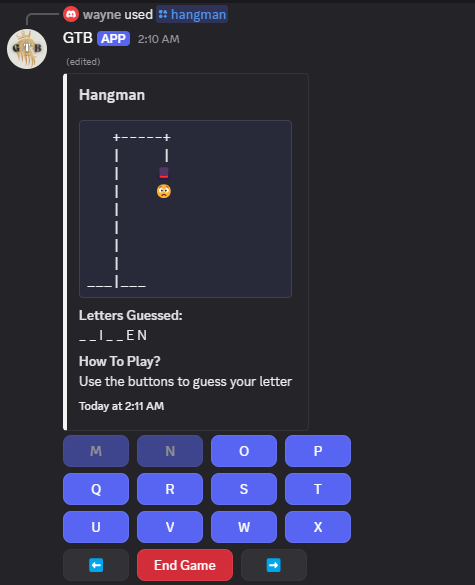
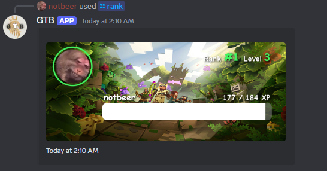

<h1 align="center">
  <br>
  <a href="https://github.com/notbeer/advanced-discord-bot"></a>
  <br>
  Advanced Discord bot
  <br>
</h1>

<h4 align="center">A Discord bot written with the help of <a href="https://discord.js.org" target="_blank">Discord.js</a>. A well-organized and user-friendly bot designed to seamlessly integrate complex yet engaging and practical features.</h4>

<p align="center">
  
</p>

<p align="center">
  <a href="#key-features">Key Features</a> •
  <a href="#how-to-use">How To Use</a> •
  <a href="#contributors">Contributors</a> •
  <a href="#license">License</a>
</p>

<p align="center">
  
</p>

## Key Features

* Sharding
* Handlers
  - A file reading event handling.
  - Reading files to load commands with features like cooldown, permissions and etc
* Commands
  - Fun
    - Board Games
      - /tictactoe
        - Ability to play with a user
        - You can also play with the discord bot
      <p align="left">
        
      </p>
      - Connect4
        - Ability to play with a user
        - You can also play with the discord bot
      <p align="left">
        
      </p>
    - Puzzles
      - /wordle
        - Remake of the popular game wordle, with a beautifully intregated canvas.
      <p align="left">
        
      </p>
      - /hangman
        - Guess the word to win. Try not to guess wrong 6 times or you loose!
      <p align="left">
        
      </p>
    - Text
      - /emojify
        - Convert a given text to emojis
      - /fliptable
        - Flip the table!
  - Misc
    - /info
      - Get information on the guild
    - /avatar
      - Get a users avatar
    - /client
      - Get information about the discord bot
  - Chat Ranking
    - /rank
      - Get a beautiful image that displays users xp, and guild ranking.
    <p align="left">
      
    </p>
  - Settings
    - /language
      - Change the discord bots language for the guild
* Languages
  - Ability to intregate multiple languages in the bot eg. English, Spanish, etc...
* Chat Rank system
  - User gets xp every 30 seconds from typing in chat. Every guild xp is seperate.
  

## How To Use

To clone and run this application, you'll need [Git](https://git-scm.com) and [Node.js](https://nodejs.org/en/download/) (which comes with [npm](http://npmjs.com)) installed on your computer. From your command line:

```bash
# Clone this repository
$ git clone https://github.com/notbeer/advanced-discord-bot

# Go into the repository
$ cd advanced-discord-bot

# Install dependencies
$ npm install
```
### Adjusting .env file
```ini
# Remove this variable if project is being deployed
PROJECT=DEVELOPMENT

# Your Discord bot Token
BOT_TOKEN=...

# Your Discord bot user ID
BOT_ID=...

# Only provide a guild ID here if you only want the commands to deploy to that guild or else keep it empty
DEVELOPMENT_GUILD_ID=...

# Mongoose Database URI
MONGO_URI=...
```

### Deploy or delete Slash Commands from application
```bash
# Deploy Slash Commands
$ npm run deploy-commands

# Delete Slash Commands
$ npm run delete-commands
```
### Run the app
```bash
# Start the js dist version of the application
$ npm run start

# Build the js dist version of the application
$ npm run build

# Build the js dist version of the application and run it
$ npm run prod

# For development purpose
$ npm run dev
```

> **Note**
> If you're using Linux Bash for Windows, [see this guide](https://www.howtogeek.com/261575/how-to-run-graphical-linux-desktop-applications-from-windows-10s-bash-shell/) or use `node` from the command prompt.

## Contributors
<a href="https://github.com/notbeer/advanced-discord-bot/graphs/contributors">
  
</a>

## Credits

This software uses the following open source packages mainly:

- [Node.js](https://nodejs.org/)
- [Discord.js](https://discord.js.org)

## License

GNU

---